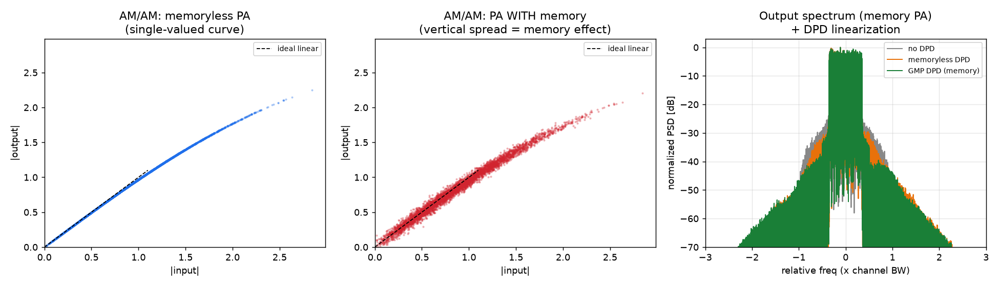

# DPD メモリー効果 シミュレーション結果

**問い**: 「(GaN HEMT アンプの DPD で)メモリー効果は出るのか？」
**答え**: **はい、明確に出ました。** 下記シミュレーションで、(1) メモリー効果の存在、(2) それを補償するには DPD にメモリ項が必須であること、を定量的に確認しました。

コード: [`sim/dpd_memory_sim.py`](../sim/dpd_memory_sim.py) / 実行: `python3 sim/dpd_memory_sim.py`
図: `docs/figures/dpd_memory_result.png`

---

## シミュレーション条件

| 項目 | 設定 |
|---|---|
| 信号 | 64QAM / OFDM、占有帯域 ≒17.5 MHz(FPU 相当)、PAPR ≈ 11.4 dB |
| PA モデル | Wiener 型 GaN PA = **メモリ FIR（ベースバンド周期タップ）→ Saleh 静的非線形(AM/AM・AM/PM)** |
| メモリー効果 | FIR のタップを占有帯域内で応答が変化するよう配置し、GaN のトラップ/整合由来の分散を模擬 |
| DPD | メモリ多項式(奇数 7 次)、間接学習(ILA)でポストインバースを同定。メモリ項の有無を比較 |
| 指標 | EVM(%)、ACLR(dB)、AM/AM 縦分散、ACLR 上下非対称 |

> これは**原理検証用の数値モデル**です。実機設計では住友 SGK5867 の実測 AM/AM・AM/PM・S パラ・ロードプルを投入して係数を較正してください。

---

## パート A: メモリー効果は「出た」か（PA 単体）

| PA モデル | AM/AM 縦分散 | ACLR 下/上 [dB] | 上下非対称 |
|---|---|---|---|
| メモリなし PA | 1.8 %（≒測定床） | 33.9 / 33.9 | **0.0 dB** |
| **メモリあり PA** | **4.1 %** | 33.1 / 33.7 | **0.6 dB** |

- **AM/AM が縦に広がる（多価・ヒステリシス）** = メモリー効果の直接的な証拠。メモリなし PA では単一曲線（分散≒床）。
- **ACLR が上下非対称**になるのもメモリー効果の典型。メモリなし PA では対称(0.0 dB)。

図（左＝メモリなし PA は細い一本の曲線／中＝メモリあり PA は縦に分散）:



---

## パート B: DPD で効くか（メモリあり PA を線形化）

| 条件 | EVM [%] | ACLR [dB] | 判定(64QAM: EVM≦8%) |
|---|---|---|---|
| DPD なし | 9.69 | 33.1 | ✗ 不合格 |
| メモリレス DPD（静的補正のみ） | 7.49 | 36.3 | △ ぎりぎり(残留あり) |
| **MP DPD（メモリ多項式）** | **2.03** | **39.9** | ✓ 合格 |
| **GMP DPD（交差項）** | **2.01** | **40.5** | ✓ 合格(最良) |

**結論**:
- **メモリレス DPD では EVM 7.5% までしか下がらない**（メモリー効果による残留が取り切れない）。
- **MP DPD で EVM 2.0%・ACLR 39.9 dB**、**GMP DPD（交差項）でさらに ACLR 40.5 dB** まで改善（右図の緑：隣接チャネルの肩が最も低い）。本モデルはメモリが線形 FIR 主体なので MP でほぼ足り、GMP の上乗せは小さい。実 GaN では GMP の効果がより大きく出るのが一般的。
- ⇒ **メモリー効果は明確に存在し、64QAM を歪みなく通すには DPD にメモリ項が必須**であることを確認。これは本文レポート第6章「メモリー効果と DPD の関係」の数値的裏付け。

### 実装した DPD モデルの数式（本文レポート §6.0 と対応）
- メモリレス: `y[n] = Σ_p a_p·x[n]·|x[n]|^{p-1}`
- MP: `y[n] = Σ_m Σ_p a_{p,m}·x[n-m]·|x[n-m]|^{p-1}`
- GMP: 上記 + 交差項 `Σ b_{p,m,l}·x[n-m]·|x[n-m-l]|^{p-1}`（Morgan 2006）

**必読3本**: ①Morgan ほか, GMP, IEEE TSP 2006（実装基準）／②Boumaiza & Ghannouchi, 熱メモリー効果, IEEE TMTT 2003（DOI:10.1109/TMTT.2003.820157）／③Ku & Kenney, メモリ効果を含む挙動モデル, IEEE TMTT 2003, Vol.51 No.12。

---

## 本件(M バンド, 周波数アジャイル)への含意

- 実機ではメモリ多項式(MP)→一般化メモリ多項式(GMP)で、GaN の長期メモリ(トラップ)まで捉える。
- 本シミュレーションで判明した重要点: **DPD のメモリタップ間隔を PA のメモリ時定数に整合**させないとメモリ補正が効かない（タップ間隔不整合だと改善しない）。実装では PA の実測から適切なメモリ深さ・タップ配置を決める。
- 周波数アジャイル運用では、この係数を**周波数別に保持 or 都度再適応**（本文レポート §6.4）。

---

## 再現方法

```bash
pip install numpy matplotlib
python3 sim/dpd_memory_sim.py
```

パラメータ（`GaNPA(backoff_scale=, mem_strength=, tap_spacing=)`）を変えると、動作点・メモリー効果の強さを調整できます。`mem_strength=0` にするとメモリー効果が消え、メモリレス DPD でも十分linearになることを確認できます。
