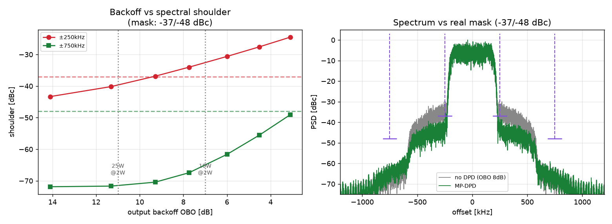

# バックオフ・デバイス選定 まとめ — 6.5 GHz(M バンド) GaN 2W/64QAM

原設計(2020, FM 福井 MN-band D-STL)の **GaAs PA が廃番(EOL)** → **現行 GaN で 2 W(+33 dBm) に作り直す**ための、
**デバイス選定** と **必要バックオフ(OBO) の机上計算** をまとめる。実条件・実マスクで検証済み（I/Q 不要）。
最終更新: 2026-09-04

---

## 0. 結論（1 行）

> **25 W 品なら DPD 無しでマスク合格（OBO 11 dB）。10 W 品で小型化するなら MP-DPD 必須（OBO 7〜8 dB＋DPD で合格）。支配要因は常に ±250 kHz の近接肩。**

---

## 1. 実条件（実機仕様 2020 より確定）

| 項目 | 値 |
|---|---|
| 変調 | 単一キャリア **64QAM**、RRC **α=0.2** |
| シンボルレート | **374.4 ksps**（占有 ≒405 kHz） |
| 実マスク | **−37 dBc @ ±250 kHz** / **−48 dBc @ ±750 kHz** |
| 出力目標 | **平均 2 W（+33 dBm）＝仕様値**（旧納入機は GaAs で 1 W） |
| PAPR | **≈6〜6.5 dB**（0.01% CCDF, α=0.2） |
| 周波数 | 6716.625 MHz（M バンド 6570–6870 MHz） |

---

## 2. 電力計算（バジェット）

```
平均出力  +33.0 dBm (2 W)
PAPR      + 6.5 dB
─────────────────────
尖頭      +39.5 dBm (≈9 W)   ← ここが Psat より数 dB 下でないと肩が立つ
```

- 64QAM は尖頭が支配 → **尖頭 +39.5 dBm を、Psat より数 dB のマージンを取って収める**必要。
- ⇒ **Psat ≥ +44 dBm(25 W) が安全**。10 W(+40 dBm) は尖頭とほぼ同レベルで **DPD 前提**。

---

## 3. 必要バックオフ vs 実マスク（シミュレーション予測）

実条件（2W・64QAM・α0.2・405 kHz・実マスク −37/−48 dBc、Saleh 代表モデル）で OBO を掃引し、
何 dB バックオフすればマスクに入るかを予測。`sim/backoff_mask_sim.py`。



*左＝OBO 掃引（赤 ±250k／緑 ±750k、破線＝マスク）。右＝10W 品運用点での 無DPD(灰) vs MP-DPD(緑)。*

### 3.1 DPD 無し（OBO 掃引）

| OBO | ±250k [dBc] | ±750k [dBc] | 判定 |
|---:|---:|---:|:--|
| 11.3 dB | **−40.2** | −71.7 | ○ 合格 |
| 9.3 dB | −36.9 | −70.4 | ×（±250k わずかに不足）|
| 7.7 dB | −34.0 | −67.4 | × |
| 6.0 dB | −30.6 | −61.6 | × |

→ **効くのは常に ±250 kHz の近接肩**（±750k は常に余裕）。**DPD 無しなら OBO 約 10〜11 dB 必要。**

### 3.2 DPD の効果（10 W 品を 2 W で運用＝OBO 7.7 dB）

| | ±250k [dBc] | ±750k [dBc] |
|---|---:|---:|
| 無 DPD | −34.0 | −67.4 |
| **MP-DPD** | **−41.6** | −64.3 |

→ **MP-DPD で ±250k を +7.6 dB 改善**、−41.6 dBc で **マスクに約 4.6 dB 余裕**。**10 W 品でも DPD で 2 W 合格圏。**

---

## 4. デバイス選定（平均 2 W=+33 dBm 運用）

| デバイス | Psat | 2W 時 OBO | DPD 無し | 位置づけ |
|---|---|---:|:--|---|
| **Wolfspeed CMPA601C025F** | **25 W(+44dBm)**, 6–12 GHz, 内部整合 | **11 dB** | **○ そのまま合格**（±250k −40 dBc, 約 3 dB 余裕）| **第一候補**。尖頭 ~4 dB 余裕、DPD は保険 |
| **Qorvo QPA1013D** | 10 W(+40dBm), 6–18 GHz | 7 dB | ×（−34 dBc, 3 dB 不足）→ **DPD で −41.6 dBc 合格** | 小型化重視。**MP-DPD 必須** |

- どちらも **MMIC PA**（6.5 GHz の整合・1/4波長問題を IC 内で解決、50 Ω 入出力）。
- **DPD の役割 = GaAs↔GaN の線形性差＋2 W 化の尖頭余裕を埋める**。

---

## 5. 設計判断と検証フロー

1. **石で余裕を取るなら 25 W 品** → DPD 無しでマスク合格、DPD は保険で持つ。
2. **小型化するなら 10 W 品＋MP-DPD** → OBO 7〜8 dB で運用、DPD で ±250k を叩く。
3. どちらも **±250 kHz の近接肩が要**。ここをバックオフ＋DPD(MP 7次/深さ5→不足なら GMP) で規格下へ。

**実機検証（I/Q 不要・スペアナのマスク測定で完結）**:
`無 DPD で実測 → ±250k マスク余裕を確認 → 足りなければ MP-DPD 投入 → 再測`。
本予測はこのフローの期待値（必要バックオフのオーダーと DPD 効き幅の傾向）を与える。

> **前提**: PA 非線形は代表 Saleh モデル（実機 AM/AM 未取得）。**絶対値でなく傾向として使用**し、
> 最終値は実機（CMPA601C025F 等）のスペアナ測定で確定する。

---

## 参照

- コード: `sim/backoff_mask_sim.py`（本予測）、`sim/dpd_memory_sim.py`（DPD/メモリー実証）
- 仕様: `実機仕様_FM福井DSTL_2020.md`（決定版諸元）
- 全体: `00_総まとめ.md`、`最終レポート.html`
